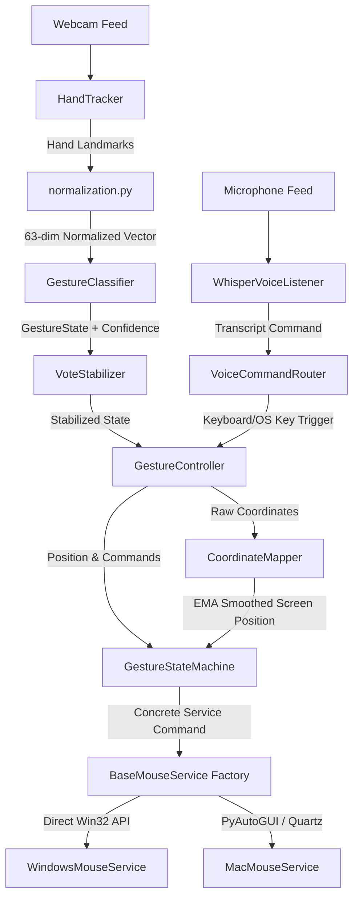

# 🤟 Gesture+ | Layered Hybrid Hand Gesture & Voice Controller

An advanced, real-time hybrid machine learning hand gesture and voice controller that transforms natural physical postures and spoken words into smooth system controls and OS-level operations.

By merging **Google MediaPipe Hand Landmarker** for positional tracking, a **Scikit-Learn Classifier** for postural classification, **OpenAI Whisper** for offline local speech command recognition, and **Platform-Specific OS APIs**, Gesture+ provides a zero-latency, hands-free workspace control system.

The codebase is built around a **layered, SOLID-compliant architecture** with strict dependency injection, allowing developer testing and modular extensions.

---

## ✨ Features

*   **🖐️ 8-State Gesture Tracking**: Features precise tracking of 8 postures (Idle, Move, Left Click, Right Click, Double Click, Drag, Scroll Up, and Scroll Down) stabilized via deque sliding-window majority voting and confidence filtering.
*   **🎙️ Offline Local Voice Commands**: Built-in VAD (Voice Activity Detection) daemon thread running local OpenAI Whisper (`tiny` model, zero API keys required) mapped to a 30-keyword fuzzy routing dictionary.
*   **🏆 Premium Glassmorphic HUD overlay**: Features an OpenCV heads-up display rendering active zone boundaries, system state, prediction confidence, real-time FPS, screen target positions, voice recording indicator, and last-voice-command transcription.
*   **⚡ Zero-Latency OS Services**:
    *   **Windows**: Native Win32 `ctypes` direct assembly calls for hardware-level cursor positioning and mouse click events.
    *   **macOS / Linux**: PyAutoGUI interface with optimized zero-pause parameters.
*   **📐 Geometrically Invariant Pre-processing**: Translates coordinates relative to the wrist and scales by middle metacarpophalangeal (MCP) distance, guaranteeing translation and scale invariance.
*   **🛡️ Fail-Safe Emergency Shutdown**: Quick fail-safe activated instantly by moving the cursor/hand to any corner of the screen (pyautogui.FailSafeException).
*   **🧪 Comprehensive Test Suite**: 102 unit/integration tests verifying the scaffold, tracking, classification, services, voice listener, state machine, and controller wiring.

---

## 🛠️ Project Architecture



### Component Breakdown

*   `main.py`: Application startup and CLI options parser.
*   `config/settings.py`: Centralized system thresholds, class configurations, colors, and default voice variables.
*   `controller/gesture_controller.py`: Engine orchestrator connecting camera frame loop, voice tracking, state machines, and HUD.
*   `tracking/`:
    *   `hand_tracker.py`: Hand landmark detector.
    *   `normalization.py`: Translates wrist to origin and normalizes dimensions.
    *   `coordinate_mapper.py`: Restricts active zone and maps with EMA smoothing.
*   `classification/`:
    *   `gesture_classifier.py`: Scikit-Learn Random Forest model predictor.
    *   `vote_stabilizer.py`: Majority vote sliding window stabilizer.
    *   `model_loader.py`: Safely deserializes pickles.
*   `state_machine/`:
    *   `gesture_state_machine.py`: Debounced state transitions, drag safety locks, and system shutdown handles.
*   `voice/`:
    *   `whisper_listener.py`: Local audio recording thread running speech-to-text.
    *   `command_router.py`: Handles keyword routing, hotkeys, and fuzzy matching.
    *   `null_listener.py`: Null Object pattern for --no-voice modes.
*   `services/`: OS mouse controllers (ctypes / pyautogui).
*   `ui/hud_renderer.py`: Visual OpenCV HUD compositing and skeletal hand visualizer.

---

## 🖐️ Hand Gesture Command Schema

| Gesture / State | Gesture Pose | Mapped Action |
| :--- | :--- | :--- |
| **`idle` (0)** | Relaxed, open hand or closed fist | System standby; no actions |
| **`move` (1)** | Index finger extended, others curled | Move cursor smoothly |
| **`click` (2)** | Thumb and index tip pinched together | Debounced primary left click |
| **`drag` (3)** | Thumb, index, and middle tips pinched | Hold left button to drag |
| **`scroll_up` (4)** | Index, middle, and ring extended upward | Scroll screen upward |
| **`scroll_down` (5)** | Index, middle, ring, pinky extended | Scroll screen downward |
| **`right_click` (6)** | Index and middle finger extended open | Debounced right click |
| **`double_click` (7)**| Hand forming a "V" (index + middle) | Debounced double click |

---

## 🎙️ Voice Keyboard Command Schema

Speak clearly into your microphone to execute key shortcuts and actions:

| Voice Command Category | Spoken Keywords (Fuzzy Match) | Key Action / Hotkey Mapped |
| :--- | :--- | :--- |
| **Document Actions** | `"copy"`, `"paste"`, `"save"`, `"cut"`, `"undo"`, `"redo"` | `ctrl+c`, `ctrl+v`, `ctrl+s`, `ctrl+x`, `ctrl+z`, `ctrl+y` |
| **Navigation** | `"tab"`, `"backspace"`, `"enter"`, `"escape"`, `"spacebar"` | `tab`, `backspace`, `enter`, `escape`, `space` |
| **Window Controls** | `"close window"`, `"maximize"`, `"minimize"`, `"screenshot"` | `alt+f4`, `win+up`, `win+down`, `printscreen` |
| **Search** | `"search"`, `"find"` | `ctrl+f` |
| **Browser Actions** | `"new tab"`, `"close tab"`, `"next tab"`, `"previous tab"` | `ctrl+t`, `ctrl+w`, `ctrl+pgdn`, `ctrl+pgup` |

---

## ⚙️ Installation

### 1. Clone the Repository
```bash
git clone https://github.com/le7-3609/hybrid-gesture-mouse.git
cd hybrid-gesture-mouse
```

### 2. Setup Virtual Environment
```bash
python -m venv venv
venv\Scripts\activate  # On macOS/Linux: source venv/bin/activate
```

### 3. Install Dependencies
```bash
pip install -r requirements.txt
```

---

## 🚀 Running the Project

### 🏋️ Step 1: Train the Model
You can collect posture training data using scripts inside `training/` or train directly.
To train a model (or generate a synthetic dataset for testing):
```bash
python training/train.py --synthetic
```

### 🕹️ Step 2: Start the System
Run the controller:
```bash
python main.py
```
To run without voice commands enabled (pure gesture mode):
```bash
python main.py --no-voice
```

#### CLI Configuration Parameters:
```text
Options:
  --model PATH         Path to model pickle (default: models/gesture_model.pkl)
  --smoothing FLOAT    EMA smoothing factor (0 = static, 1 = raw) (default: 0.25)
  --confidence FLOAT   Minimum ML probability threshold to accept predictions (default: 0.75)
  --history INT        Sliding window vote size (default: 7)
  --debounce FLOAT     Click cooldown in seconds (default: 0.4)
  --scroll-sens FLOAT  Scroll speed factor (default: 1.5)
  --no-voice           Disable voice listener (forces NullVoiceListener mode)
```

---

## 🧪 Running Unit Tests

Run the full pytest suite to verify all system layers:
```bash
python -m pytest tests/
```

---

## 🛡️ License

Distributed under the MIT License. See `LICENSE` for details.
